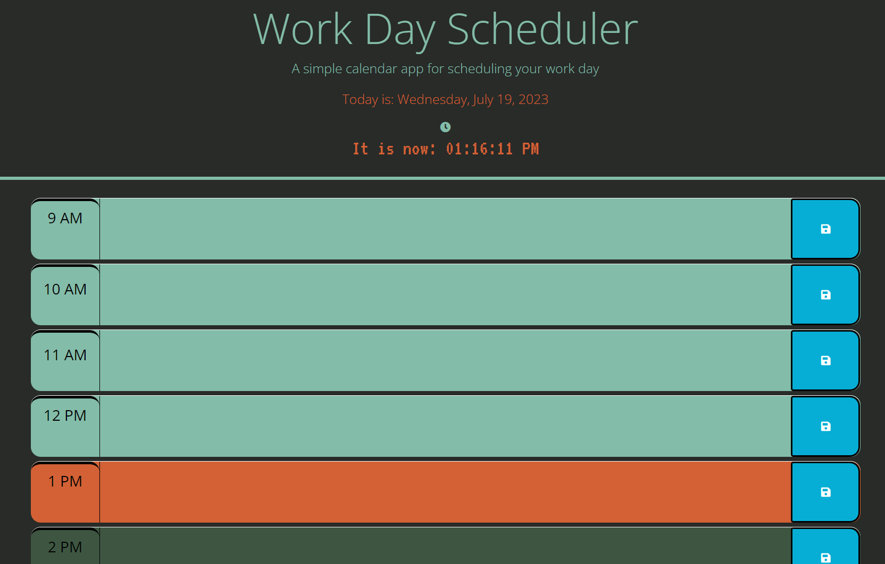

# Module Five Challenge: Thrid-Party API Work Day Scheduler

## Description
Our goal was to create a day planner. The app would reflect the current date and have hour blocks for business hours (9 to 5) and color coded to indicate past, present, or future. Users could input notes/reminders in these blocks and save them. Upon revisiting the app, previous events/notes would persist.

This app made use of jQuery to handle most DOM manipulation and [Day.js](https://day.js.org/en/) for time/date related manipulation.

I had the most difficulty with handling the eventlistener (making sure the correct target was chose) and storing/retrieving the saved events from local storage.


## Acceptance Criteria

Minimun viable product must include the following functionality/features:

```
GIVEN I am using a daily planner to create a schedule:

WHEN I open the planner
THEN the current day is displayed at the top of the calendar


WHEN I scroll down
THEN I am presented with timeblocks for standard business hours of 9am to 5pm


WHEN I view the timeblocks for that day
THEN each timeblock is color coded to indicate whether it is in the past, present, or future


WHEN I click into a timeblock
THEN I can enter an event


WHEN I click the save button for that timeblock
THEN the text for that event is saved in local storage


WHEN I refresh the page
THEN the saved events persist

```

## Mock-Up

The following is a preview of the final product:


The latest version of the webpage is active at:

https://omar-razo.github.io/third-party-api-day-scheduler/

## Installation

N/A

## Credits

jQuery documentation was visited often:

https://api.jquery.com/

https://api.jquery.com/on/

https://api.jquery.com/val/

Day.js documentation was used:

https://day.js.org/docs/en/installation/installation

Concerning the trouble of getting the right target/value from eventlistener:

https://www.tutorialrepublic.com/faq/how-to-get-the-value-of-a-textarea-in-jquery.php#:~:text=Answer%3A%20Use%20the%20jQuery%20val,it%20may%20cause%20unexpected%20results.

https://www.digitalocean.com/community/tutorials/js-array-search-methods

https://developer.mozilla.org/en-US/docs/Web/JavaScript/Reference/Global_Objects/Array/find